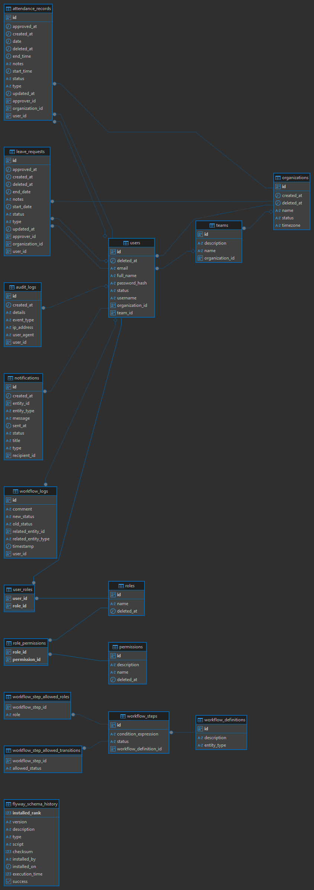
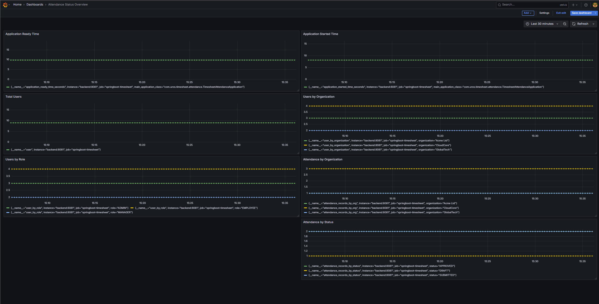
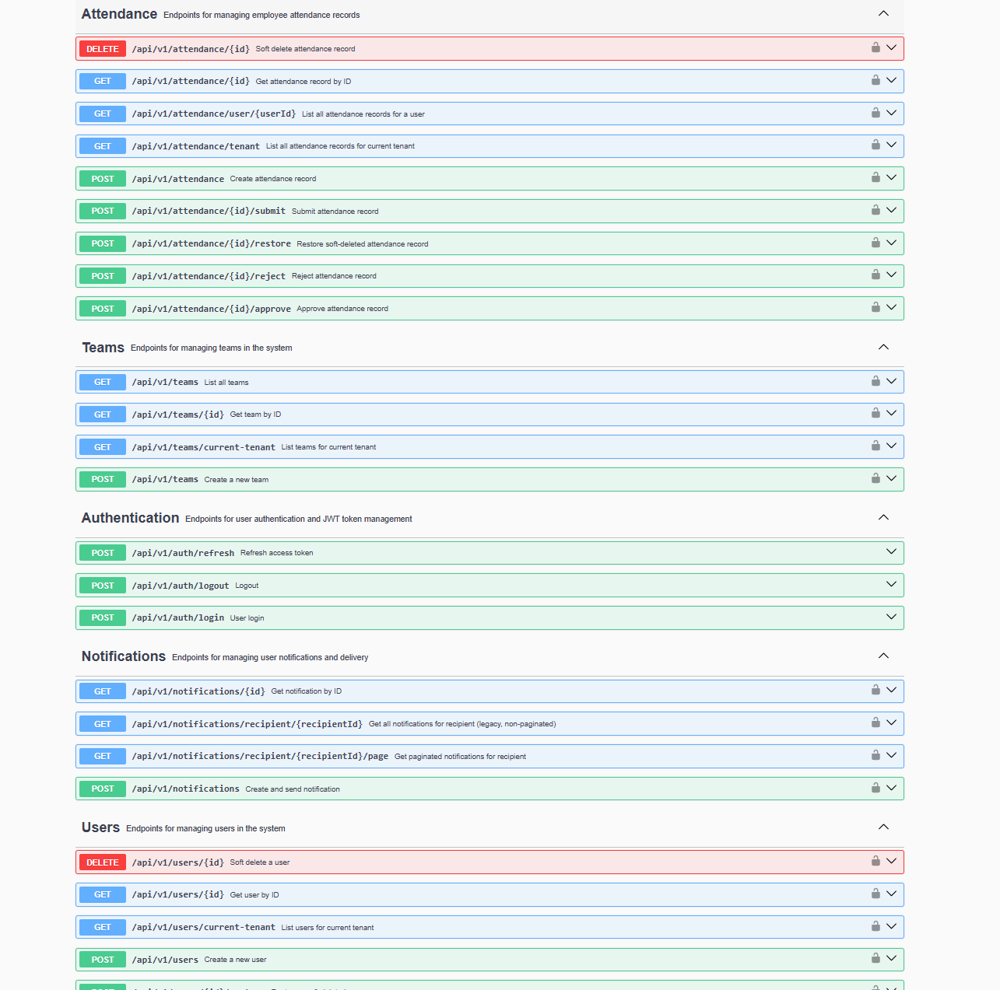
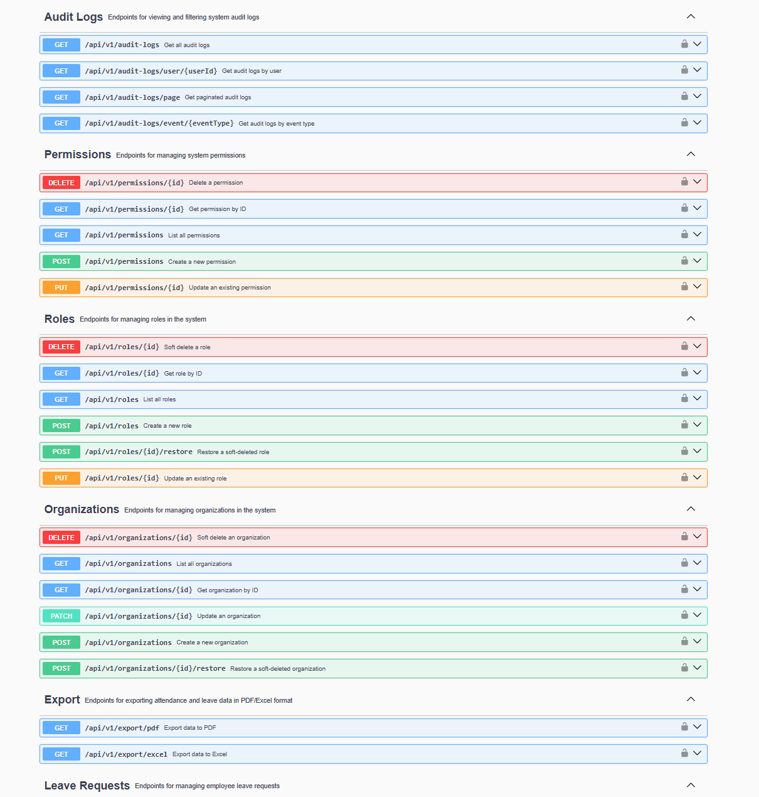
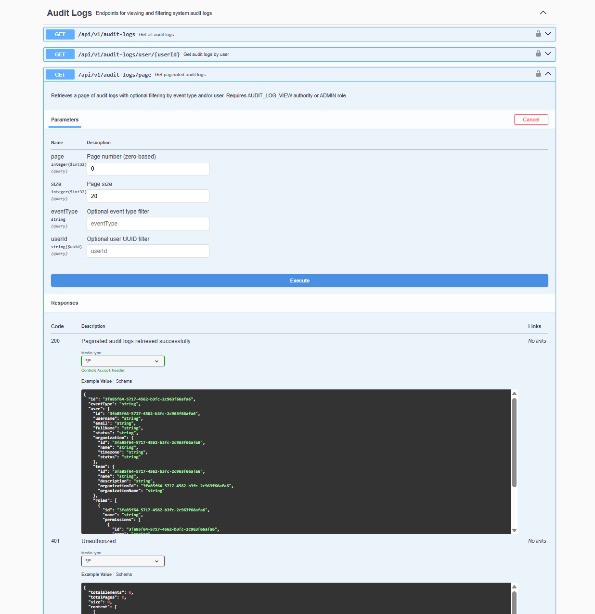
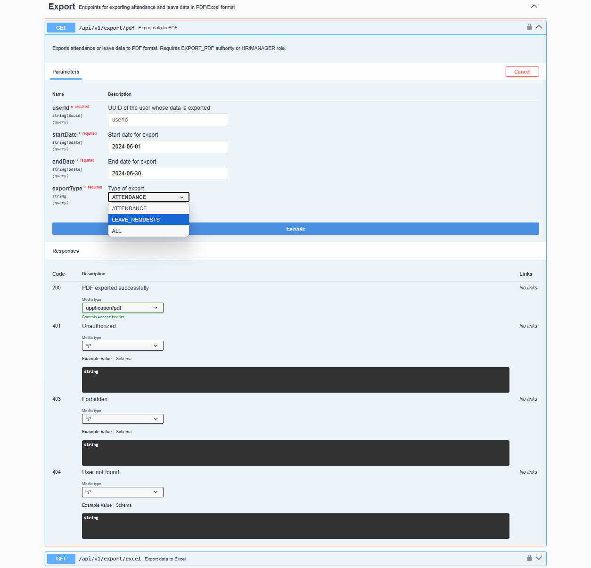
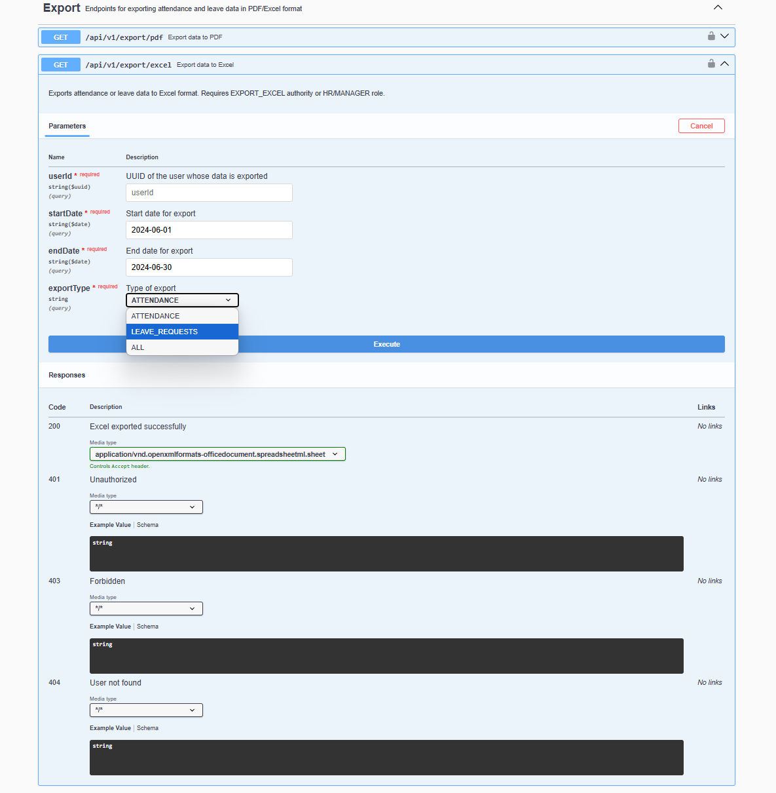
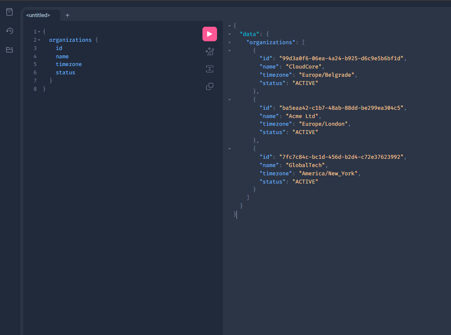

# timesheet-attendance-platform

> **Curated and maintained by Uros — a backend engineer specializing in enterprise Java/Spring Boot solutions.  
> This repository demonstrates best practices in modern backend, identity management, workflow automation, and observability for business-critical SaaS applications.**

---

## About this Repository

This portfolio codebase presents a robust, production-grade backend platform for attendance, leave management, notification, and workflow automation in multi-tenant environments.  
It is designed for technical review, architectural demonstration, and professional code evaluation—not for direct production deployment.

---

## Features

- 📊 **REST & GraphQL API** — Full business coverage, Swagger/OpenAPI 3 documentation, and live GraphiQL playground
- 🔒 **JWT authentication & authorization** — Stateless, granular, and fully RBAC/PBAC compliant
- 🛡️ **Role-based & permission-based access control** — Fine-grained security for all endpoints and business workflows
- 🚀 **Domain-driven, modular architecture** — Clean separation of controller, service, handler, repository, and mapping layers
- 🗂️ **Multi-tenancy** — Organizational data isolation, with tenant context on every request
- 📝 **Audit logging & workflow event system** — Immutable, filterable audit trail for every sensitive operation
- 🔔 **Notification system** — Extensible delivery (Email, WebSocket, Dummy/Test) with full observability and audit
- 👥 **User, Organization, Role, Permission, Team, Attendance, Leave** — Rich, normalized entity model
- 🗃️ **Soft deletion, restoration, and full traceability** — Data is never lost; every status transition is logged
- 📨 **Internationalization (i18n)** — English & Serbian out-of-the-box, easy extension to other languages
- 🖇️ **File export** — PDF, Excel, and CSV export endpoints for all core business data
- 📦 **Production-grade containerization** — Docker Compose for DB, backend, Prometheus, Grafana (one-step onboarding)
- 📈 **Observability & monitoring** — Micrometer, Prometheus, Grafana dashboards for all system & business KPIs
- ✅ **Extensive unit tests for all key service layers and workflows**

---

## Technologies

- Java 21+
- Spring Boot 3.5+, Spring Security 6+
- Spring Data JPA, Hibernate
- Flyway (DB migrations)
- PostgreSQL
- MapStruct (DTO/entity mapping)
- Micrometer, Prometheus, Grafana
- Thymeleaf (email templating)
- Docker & Docker Compose
- Gradle (primary build tool; Maven build scripts available upon request)
- WebSocket (STOMP)
- OpenAPI / Swagger 3
- JUnit 5, Mockito, AssertJ (testing)

---

## 🟢 Runnable Demo – Quick Start

This project is a fully runnable Spring Boot backend.
You can clone the repository, build the app, and launch all services using Docker Compose.

**Instructions:**

Start all services (build and run everything in Docker):

```bash
docker-compose up --build
```

All services (backend, PostgreSQL, Prometheus, Grafana) will start automatically.

**Default ports:**

- Backend: http://localhost:8081
- Swagger UI: http://localhost:8081/swagger-ui.html
- GraphiQL: http://localhost:8081/graphiql
- Prometheus: http://localhost:9090
- Grafana: http://localhost:3000 (admin/admin)

All credentials and demo secrets are intentionally visible for portfolio/demo use!

---

## Helper Script (Linux / MacOS)

If you are on Linux or MacOS, you can use the included helper script to automate the build and startup process:

```
./run-demo.sh
```

Tip: If you get a "Permission denied" error, make the script executable:

```
chmod +x run-demo.sh
```

---

## Windows users

If you are on Windows, you can use the included helper script:

```cmd
run-demo.cmd
```

## Demo User Accounts

Use the following demo accounts to authenticate via Swagger UI (`/swagger-ui.html`) or to test API endpoints:

| Username         | Password     | Role(s)     | Organization | Description          |
|------------------|--------------|-------------|--------------|----------------------|
| uros             | admin123     | ADMIN       | CloudCore    | Full admin access    |
| james.smith      | acmeadmin    | ADMIN       | Acme Ltd     | Admin for Acme Ltd   |
| sophia.wilson    | gtadmin      | ADMIN       | GlobalTech   | Admin for GlobalTech |
| alison.carter    | manager123   | MANAGER     | CloudCore    | Manager role         |
| michael.evans    | employee123  | EMPLOYEE    | CloudCore    | Regular employee     |
| lucy.taylor      | employee123  | EMPLOYEE    | CloudCore    | Regular employee     |
| olivia.jones     | hrmanager    | MANAGER     | Acme Ltd     | Manager (Support)    |
| daniel.moore     | acmedeveloper| EMPLOYEE    | Acme Ltd     | Product team member  |
| liam.martin      | globalemp    | EMPLOYEE    | GlobalTech   | Marketing employee   |

> **Note:**  
> In this portfolio/demo configuration, the `ADMIN` role is intentionally granted full access to all endpoints to simplify testing and demonstration.  
> In production, RBAC/PBAC policies should be tailored to actual organizational requirements.

---

## Database ER Diagram

Entity-Relationship (ER) diagram shows all core tables and relationships (User, Organization, Team, Role, Permission, Attendance, Leave, Notification, AuditLog, WorkflowLog).


*Entity-Relationship diagram: all core tables and relationships in the system.*

Most business entities are organization-scoped for multi-tenant isolation (Role and Permission are global).  
Soft delete and workflow status fields apply to all critical entities, enabling traceability and auditability.

---

## Configuration & Bootstrapping

- **application.yml:** Developer-friendly defaults, parametrized for demo onboarding (dev profile, visible creds, open CORS)
- **Database:** PostgreSQL, managed via Flyway migrations (`db/migration`)
- **Connection pool:** HikariCP
- **JPA:** Hibernate, `ddl-auto=validate` (safe for demo/review, recommend strict migration in prod)
- **Internationalization:** All messages localized (EN, SR), easy extension (`messages.properties`)
- **GraphQL:** REST & GraphQL endpoints, GraphiQL at `/graphiql`
- **Security:** JWT config, strong secrets, RBAC/PBAC, method-level security
- **Notifications:** Email (Thymeleaf, JavaMail), WebSocket (real-time)
- **Swagger:** OpenAPI 3, full endpoint documentation, `swagger-ui.html`
- **Spring Actuator:** Health, info, custom Prometheus metrics
- **Monitoring:** Prometheus + Grafana dashboards, auto-wired
- **Containerization:** Dockerfile, docker-compose.yml (DB, backend, Prometheus, Grafana, volume persistence)
- **Helper scripts:** `run-demo.sh` / `run-demo.cmd` for one-step onboarding

---

## Security, Authentication, and Authorization

- **JWT-based authentication:** Stateless access & refresh tokens, all claims (user/org/roles/perms) in JWT
- **Refresh token blacklisting:** Prevents replay (in-memory for demo; swap to Redis for prod)
- **RBAC/PBAC:** Dynamic @PreAuthorize checks, method-level security, granular role/permission resolution
- **BCrypt password hashing**
- **Custom exception handlers:** Localized, structured errors for forbidden/unauthorized access
- **Open CORS for local/demo** (lock down in prod via config)
- **All endpoints protected:** REST, GraphQL, WebSocket (JWT handshake)
- **Multi-tenancy enforced:** Every request tied to org via JWT claim/context

---

## Domain Model & Multi-Tenancy

- **Full entity coverage:** User, Organization, Team, Role, Permission, AttendanceRecord, LeaveRequest, Notification, AuditLog, WorkflowLog
- **Multi-tenancy:** All critical business entities (User, AttendanceRecord, LeaveRequest, Notification, etc.) are organization-scoped via per-request tenant context (ThreadLocal). Role and Permission entities are global, enabling centralized access control definitions shared across all tenants
- **Soft delete:** All critical entities use `deletedAt`, isDeleted/restore helpers, full audit trail
- **Status-driven workflows:** Attendance & leave records managed by central workflow engine; all status changes audited and reversible
- **Notification system:** Type-safe enum, channel-agnostic delivery, extensible for new business/event types
- **Audit & WorkflowLog:** Immutably logs all sensitive ops, status changes, approvals, rejections, deletions, with actor/context info

---

## API Modeling & DTO Layer

- **No entities exposed via API** — only DTOs, strictly versioned and organized per business domain
- **Swagger/OpenAPI annotated:** All DTOs are auto-documented for clear frontend/backend contract
- **Dedicated DTOs:** Create/Update, Response, Export, Audit, Notification, Auth
- **UUIDs for all resource IDs**
- **Request/response separation:** Enables API evolution and backward compatibility

---

## Mapping & Service Layer

- **MapStruct-powered:** All DTO<->entity transformations are compile-time, declarative, and testable
- **Service orchestration:** Controllers delegate to services (transactional boundaries, validation, metrics, audit, notification)
- **Handler pattern:** Business actions encapsulated per handler (approve, reject, delete, restore), supporting modularity and testability
- **Workflow engine:** Centralized state machine validation for status-driven entities

---

## Controller/API Layer

- **REST & GraphQL APIs:** Every core business object is exposed via REST endpoints (full CRUD & workflow actions) and via GraphQL queries (read-only).
- **Versioned & discoverable:** All endpoints under `/api/v1/...`, full OpenAPI/Swagger coverage
- **GraphiQL IDE:** For live GraphQL exploration (`/graphiql`)
- **Export & reporting endpoints:** Download business data in CSV, Excel, or PDF for BI or compliance
- **WebSocket (STOMP):** Real-time notifications, per-user or broadcast, secured with JWT
- **Thin, maintainable controllers:** No business logic, only API contract/security/delegation

---

## Audit Logging & Workflow Events

- **AuditLog entity:** Persists all sensitive events (login, create, delete, approve, reject, status change, etc.) with user/context/time
- **WorkflowLog:** Tracks status transitions, approval/rejection, and comments per entity
- **Immutable and queryable:** For compliance and regulatory review
- **APIs:** Secure, paginated, and filterable log endpoints (by user, event type)
- **All logs localized and fully DTO-encapsulated**

---

## Notification & Real-Time Messaging

- **Email notifications:** HTML, branded, localized (Thymeleaf), demo SMTP config
- **WebSocket notifications:** Real-time to users, JWT-secured handshake, per-user queues
- **Dummy channel:** Test, mock, or non-delivery scenarios
- **Type-safe NotificationType enum:** For business and delivery types
- **All sends audited, instrumented, and visible in metrics**

---

## Exception Handling

- **GlobalExceptionHandler:** All errors mapped to structured JSON with timestamp, status, message, and localization
- **Domain-specific exceptions:** Export, workflow, validation, not found, forbidden/unauth, etc.
- **No stack traces or sensitive data exposed**

---

## Database Seeder & Demo Data

- **Turnkey onboarding:** On first run, all core data is seeded (orgs, users, roles, perms, teams, attendance, leave, audit, workflow, notifications)
- **Idempotent & modular:** Each seeder is isolated and checks data presence before insert
- **Realistic scenarios:** All workflow transitions, logs, notifications, and approvals are simulated
- **Easy extension:** Add/modify scenarios in one class per domain

---

## Observability & Monitoring

- **Prometheus:** Scrapes `/actuator/prometheus` every 15s, all system & business KPIs exported  
- **Grafana:** Pre-wired dashboards (app readiness, users, attendance, orgs, roles)  
- **Micrometer:** All custom metrics registered in code, extensible for new KPIs  
- **One-step launch:** Monitoring stack included in Docker Compose

**Quick access:**
- Prometheus: [http://localhost:9090](http://localhost:9090)
- Grafana: [http://localhost:3000](http://localhost:3000) (admin/admin)

---

### Example: Grafana Monitoring Dashboard

The platform ships with a production-style Grafana dashboard that visualizes live system and business KPIs exposed via Prometheus.


*Sample dashboard: Application readiness, total users, users by role/organization, attendance records by status/organization, and more.*

- **All panels are fully wired:** Application health, user/attendance metrics, organizational segmentation.
- **Demonstrates real-time observability** for business-critical SaaS applications.
- **Ready for further extension** with any Prometheus/Micrometer-compatible metric.

---

## Testing

- **JUnit 5 + Mockito/AssertJ:** Modular, isolated unit tests for all core services
- **Coverage:** CRUD, soft-delete, restore, workflow, notification, audit, metrics, error handling
- **Edge cases covered:** Permission/denied, DTO validation, transaction rollback
- **Test data builders:** For maintainable test setup
- **CI-ready:** Add JaCoCo for coverage enforcement as needed

---

## API Documentation

All endpoints are fully documented using Swagger/OpenAPI.
Below are example screenshots from the live Swagger UI:

### API Endpoint Overview


*Grouped endpoints – Attendance, Teams, Authentication, Notifications, Users*


*Grouped endpoints – Audit Logs, Permissions, Roles, Organizations, Export, Leave Requests*

### Example: Audit Log Query


*Paginated audit log querying with filters and sample response*

### Example: Export Endpoint


*PDF export endpoint: parameters, response codes, and format selection*


*Excel export endpoint: parameters, response codes, and format selection*

---

## GraphQL Playground Demo

An interactive GraphQL IDE is available at [`/graphiql`](http://localhost:8081/graphiql), providing live querying of key business entities:

- **Users** (`user`, `users`)
- **Organizations** (`organization`, `organizations`)
- **Teams** (`team`, `teams`)
- **Roles and Permissions** (`role`, `roles`)
- **Attendance Records** (`attendanceRecord`, `attendanceRecordsForUser`)

> **Note:**  
> The GraphQL API is currently **read-only** (queries only), by design.  
> All mutations (create/update/delete, workflow actions) are provided exclusively via the REST API.
> 
> This separation is intentional for portfolio/demo purposes, focusing on safe, query-driven exploration of the business model.  
> Write operations can be extended as needed for production scenarios.

  
*GraphQL playground: Example query for organizations and real-time result.*

---

## Project Structure

```
├── .gradle/
├── .idea/
├── build/
├── docs/
│   └── (ER diagrams, API screenshots, Grafana dashboards, etc.)
├── monitoring/
│   ├── application-ready-time-dashboard.json
│   ├── application-started-time.json
│   ├── attendance-records-by-organization.json
│   ├── attendance-status-overview.json
│   ├── prometheus.yml
│   ├── total-users.json
│   ├── users-by-role.json
│   └── users-per-organization.json
├── src/
│   ├── main/
│   │   ├── java/
│   │   │   └── com/uros/timesheet/attendance/
│   │   │        ├── auditlog/
│   │   │        ├── config/
│   │   │        ├── controller/
│   │   │        ├── domain/
│   │   │        ├── dto/
│   │   │        ├── enums/
│   │   │        ├── event/
│   │   │        ├── exception/
│   │   │        ├── graphql/
│   │   │        ├── health/
│   │   │        ├── i18n/
│   │   │        ├── mapper/
│   │   │        ├── metrics/
│   │   │        ├── notification/
│   │   │        ├── repository/
│   │   │        ├── seeder/
│   │   │        ├── security/
│   │   │        ├── service/
│   │   │        ├── util/
│   │   │        ├── websocket/
│   │   │        └── workflow/
│   │   └── resources/
│   │        ├── db/migration/
│   │        ├── graphql/
│   │        ├── templates/
│   │        ├── application.yml
│   │        ├── messages.properties
│   │        └── messages_sr.properties
│   └── test/
│        └── java/com/uros/timesheet/attendance/
│            ├── security/
│            ├── service/
│            └── ...
├── .gitattributes
├── .gitignore
├── build.gradle
├── docker-compose.yml
├── Dockerfile
├── gradlew
├── gradlew.bat
├── HELP.md
├── README.md
├── run-demo.cmd
├── run-demo.sh
└── settings.gradle
```

## Production Usage & Portfolio Notice

> ⚠️ **Portfolio/Demo Mode:**  
> This repository is provided strictly for portfolio and demonstration purposes.  
> All credentials, secrets, and configs are public for code review.  
> Not a production deployment — full business logic, proprietary modules, and advanced integrations remain private.  
> Build/run instructions are for local onboarding and review, not for direct prod use.
>
> **For full access (NDA/enterprise review):**  
> Contact via LinkedIn or Upwork to discuss private review, architecture consultations, or codebase deep-dive.

---

## Portfolio & Contact

For technical deep-dive, architecture consultations, or backend contract work, contact via  
[Upwork](https://www.upwork.com/freelancers/~01fec0932cf5314b14) or [LinkedIn](https://www.linkedin.com/in/uros-ilic-6a201436a/).

## License

This project is licensed under the MIT License. See the [LICENSE](./LICENSE) file for details.

## Contribution

This is a personal portfolio project; **external contributions are not being accepted** at this time.

---
